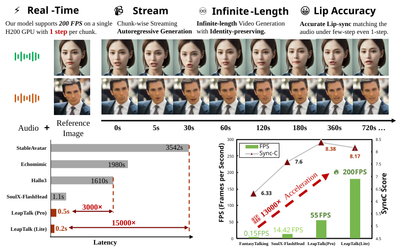
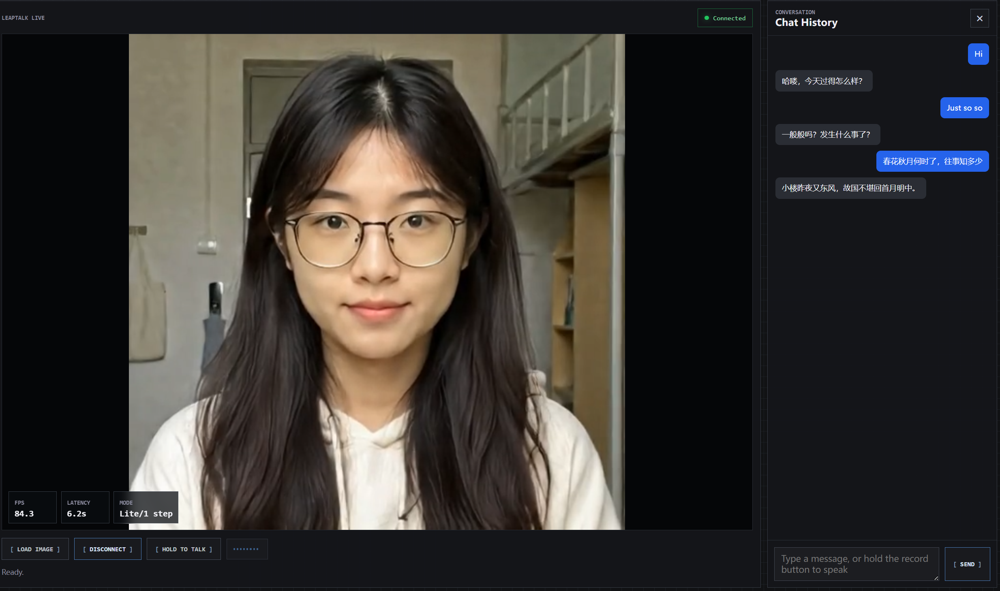

# LeapTalk: Breaking the Latency–Quality Trade-off in Talking Head Generation 🎥✨

<br>

<a href="https://zhangrongxiang.github.io/leaptalk-page/"></a>
<a href="https://arxiv.org/abs/2608.00079"></a>
<a href="https://huggingface.co/z-rx/leaptalk"></a>


## ⭐Highlights
- **Real-time streaming**: Generate open-ended talking-head videos from a reference image and speech audio in a chunk-by-chunk streaming pipeline.
- **One-step inference**: Synthesize each video chunk with only **1 NFE**, reaching up to **200 FPS** in the Lite setting.
- **High-fidelity lip synchronization**: Audio-driven classifier-free guidance strengthens mouth motion and speech alignment under extreme step reduction.
- **Stable long-video identity**: Preserve facial structure, appearance, and visual style over long rollouts by reformulating talking-head generation as a data-to-data transport process via a Brownian bridge model, implemented through a novel **Bridge Forcing** paradigm.

## 🔧Installation
#### 1. Create a Conda environment
```bash
conda create -n leaptalk python=3.12
conda activate leaptalk
```

#### 2. Install PyTorch
```bash
pip install torch==2.7.1 torchvision==0.22.1 torchaudio==2.7.1
```

#### 3. Install other dependencies
```bash
pip install -r requirements.txt
```

#### 4. Download models
```bash
pip install "huggingface_hub[cli]"

huggingface-cli download Soul-AILab/SoulX-FlashHead-1_3B \
  --local-dir ./models/SoulX-FlashHead-1_3B

huggingface-cli download facebook/wav2vec2-base-960h \
  --local-dir ./models/wav2vec2-base-960h

huggingface-cli download z-rx/leaptalk \
  --local-dir ./models/leaptalk
```

`SoulX-FlashHead-1_3B` is used as the base model. The LeapTalk checkpoint directory contains the LoRA weights, `audio_proj_step_*.pt`, and the Lite TAE checkpoint; the TAE path is resolved automatically when `LITE=1`.

#### 5. Fill paths and run inference
Edit `inf.sh` with your local paths:
```bash
CKPT_DIR="./models/SoulX-FlashHead-1_3B"
WAV2VEC_DIR="./models/wav2vec2-base-960h"
LORA_DIR="./models/leaptalk"
AUDIO_PROJ="./models/leaptalk/audio_proj_step_10400.pt"
COMPILE="off"
NUM_INFERENCE_STEPS="1"
LITE="1"
COND_IMAGE="YOUR_REFERENCE_IMAGE_PATH"
AUDIO_PATH="YOUR_AUDIO_PATH"
```

Then run:
```bash
bash inf.sh
```

## Web Demo
The web demo provides a real-time digital human conversation experience. After loading a portrait image, users can interact with the digital human through either text messages or microphone speech. The left side shows the streaming speaking video and runtime metrics, while the right side keeps the user input and dialogue history.


#### 1. Configure keys and model paths
```bash
cp .env.example .env
```

Fill the Doubao APP ID/ACCESS TOKEN (Can be obtained from this [tutorial](https://www.volcengine.com/docs/6561/2119699?lang=zh))  and the LeapTalk model paths in `.env`:
```bash
DOUBAO_APP_ID=YOUR_DOUBAO_APP_ID
DOUBAO_ACCESS_TOKEN=YOUR_DOUBAO_ACCESS_TOKEN
LEAPTALK_CKPT_DIR="./models/SoulX-FlashHead-1_3B"
LEAPTALK_WAV2VEC_DIR="./models/wav2vec2-base-960h"
LEAPTALK_LORA_DIR="./models/leaptalk"
LEAPTALK_AUDIO_PROJ="./models/leaptalk/audio_proj_step_10400.pt"
```

`DOUBAO_API_KEY` is kept as an optional fallback, but the web demo prefers the `DOUBAO_APP_ID` / `DOUBAO_ACCESS_TOKEN` pair when both are present.

#### 2. Start the web server
```bash
python web_server.py
```

Open `http://localhost:7860`, load a portrait image, connect, then type a message or hold the record button to talk with the digital human in real time.

## 🔥Training
#### 1. Prepare VividHead
Download the training dataset from [Soul-AILab/VividHead](https://huggingface.co/datasets/Soul-AILab/VividHead):
```bash
huggingface-cli download Soul-AILab/VividHead \
  --repo-type dataset \
  --local-dir ./data/VividHead
```

The training script expects the dataset to contain paired videos and audios:
```text
data/VividHead/
├── videos/
└── audios/
```

#### 2. Fill training paths
`train.sh` uses the downloaded base model and wav2vec paths by default:
```bash
CKPT_DIR="./models/SoulX-FlashHead-1_3B"
WAV2VEC_DIR="./models/wav2vec2-base-960h"
VIDEO_DIR="./data/VividHead/videos"
AUDIO_DIR="./data/VividHead/audios"
SAVE_DIR="./outputs/train"
```

#### 3. Run training
```bash
bash train.sh
```

## Community / Integrations

- [ComfyUI-LeapTalk](https://github.com/hiroki-abe-58/ComfyUI-LeapTalk) by [@hiroki-abe-58](https://github.com/hiroki-abe-58): An unofficial ComfyUI integration for generating talking-head videos from a portrait and speech audio. See the integration repository for setup instructions, demos, and limitations.

## Citation
If you find this work useful, please consider citing:
```bibtex
@misc{zhang2026leaptalkbreakinglatencyqualitytradeoff,
      title={LeapTalk: Breaking the Latency-Quality Trade-off in Talking Head Generation}, 
      author={Rongxiang Zhang and Songhua Liu},
      year={2026},
      eprint={2608.00079},
      archivePrefix={arXiv},
      primaryClass={cs.CV},
      url={https://arxiv.org/abs/2608.00079}, 
}
```
