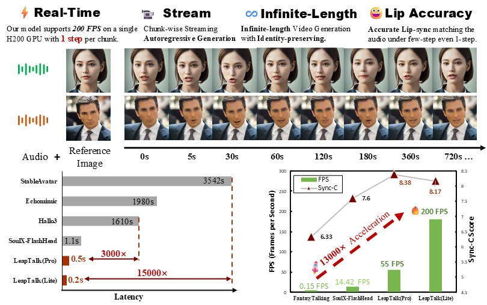

# LeapTalk: Breaking the Latency–Quality Trade-off in Talking Head Generation 🎥✨

<br>

<a href="https://zhangrongxiang.github.io/leaptalk-page/"></a>
<a href="https://arxiv.org/abs/2511.23199"></a>
<a href="https://huggingface.co/z-rx/leaptalk"></a>

> **ViBT: Vision Bridge Transformer at Scale**
> <br>
> [Rongxiang Zhang](https://zhangrongxiang.github.io)<sup>1,2</sup>, [Songhua Liu](https://huage001.github.io)<sup>1</sup>
> <br>
> 1.School of Artificial Intelligence, Shanghai Jiao Tong University; 2.Harbin Institute of Technology
> <br>

## ⭐Highlights
- **Real-time streaming**: Generate open-ended talking-head videos from a reference image and speech audio in a chunk-by-chunk streaming pipeline.
- **One-step inference**: Synthesize each video chunk with only **1 NFE**, reaching up to **200 FPS** in the Lite setting.
- **High-fidelity lip synchronization**: Audio-driven classifier-free guidance strengthens mouth motion and speech alignment under extreme step reduction.
- **Stable long-video identity**: Preserve facial structure, appearance, and visual style over long rollouts by combining Brownian Bridge anchoring with autoregressive motion prefixes.

## 🔧Installation
#### 1. Create a Conda environment
```bash
conda create -n leaptalk python=3.12
conda activate leaptalk
```

#### 2. Install PyTorch
```bash
pip install torch==2.7.1 torchvision==0.22.1 
```

#### 3. Install other dependencies
```bash
pip install -r requirements.txt
```

#### 4. Download models
```bash
pip install "huggingface_hub[cli]"

huggingface-cli download Soul-AILab/SoulX-FlashHead-1_3B \
  --local-dir ./models/SoulX-FlashHead-1_3B

huggingface-cli download facebook/wav2vec2-base-960h \
  --local-dir ./models/wav2vec2-base-960h

huggingface-cli download z-rx/leaptalk \
  --local-dir ./models/leaptalk
```

`SoulX-FlashHead-1_3B` is used as the base model. The LeapTalk checkpoint directory contains the LoRA weights, `audio_proj_step_*.pt`, and the Lite TAE checkpoint; the TAE path is resolved automatically when `LITE=1`.

#### 5. Fill paths and run inference
Edit `inf.sh` with your local paths:
```bash
CKPT_DIR="./models/SoulX-FlashHead-1_3B"
WAV2VEC_DIR="./models/wav2vec2-base-960h"
LORA_DIR="./models/leaptalk"
AUDIO_PROJ="./models/leaptalk/audio_proj_step_10400.pt"
COMPILE="off"
NUM_INFERENCE_STEPS="1"
LITE="1"
COND_IMAGE="YOUR_REFERENCE_IMAGE_PATH"
AUDIO_PATH="YOUR_AUDIO_PATH"
```

Then run:
```bash
bash inf.sh
```

## 🔥Training
#### 1. Prepare VividHead
Download the training dataset from [Soul-AILab/VividHead](https://huggingface.co/datasets/Soul-AILab/VividHead):
```bash
huggingface-cli download Soul-AILab/VividHead \
  --repo-type dataset \
  --local-dir ./data/VividHead
```

The training script expects the dataset to contain paired videos and audios:
```text
data/VividHead/
├── videos/
└── audios/
```

#### 2. Fill training paths
`train.sh` uses the downloaded base model and wav2vec paths by default:
```bash
CKPT_DIR="./models/SoulX-FlashHead-1_3B"
WAV2VEC_DIR="./models/wav2vec2-base-960h"
VIDEO_DIR="./data/VividHead/videos"
AUDIO_DIR="./data/VividHead/audios"
SAVE_DIR="./outputs/train"
```

#### 3. Run training
```bash
bash train.sh
```
